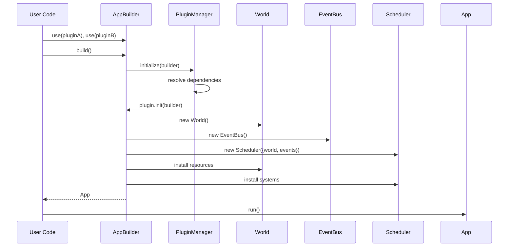
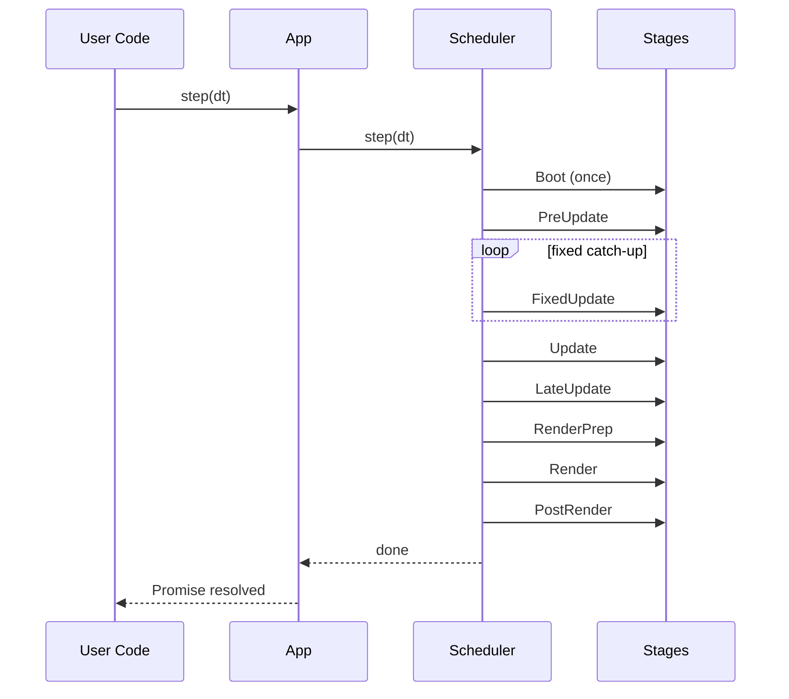
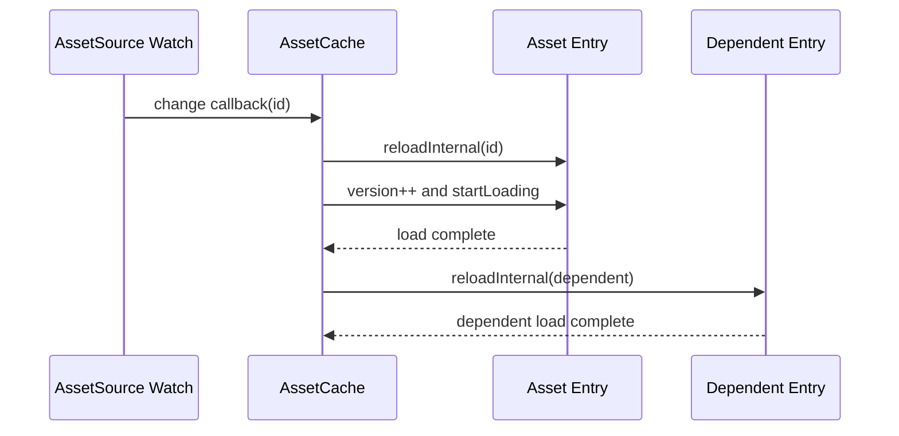

# Runtime Sequences

## Build and Startup

```mermaid
sequenceDiagram
  participant U as User Code
  participant B as AppBuilder
  participant P as PluginManager
  participant W as World
  participant E as EventBus
  participant S as Scheduler

  U->>B: use(pluginA), use(pluginB)
  U->>B: build()
  B->>P: initialize(builder)
  P->>P: resolve dependencies
  P->>B: plugin.init(builder)
  B->>W: new World()
  B->>E: new EventBus()
  B->>S: new Scheduler({world, events})
  B->>W: install resources
  B->>S: install systems
  B-->>U: App
  U->>App: run()
```

## Frame Step

```mermaid
sequenceDiagram
  participant U as User Code
  participant A as App
  participant S as Scheduler
  participant St as Stages

  U->>A: step(dt)
  A->>S: step(dt)
  S->>St: Boot (once)
  S->>St: PreUpdate
  loop fixed catch-up
    S->>St: FixedUpdate
  end
  S->>St: Update
  S->>St: LateUpdate
  S->>St: RenderPrep
  S->>St: Render
  S->>St: PostRender
  S-->>A: done
  A-->>U: Promise resolved
```

## Asset Reload Cascade

```mermaid
sequenceDiagram
  participant Src as AssetSource Watch
  participant C as AssetCache
  participant A as Asset Entry
  participant D as Dependent Entry

  Src->>C: change callback(id)
  C->>A: reloadInternal(id)
  C->>A: version++ and startLoading
  A-->>C: load complete
  C->>D: reloadInternal(dependent)
  D-->>C: dependent load complete
```
